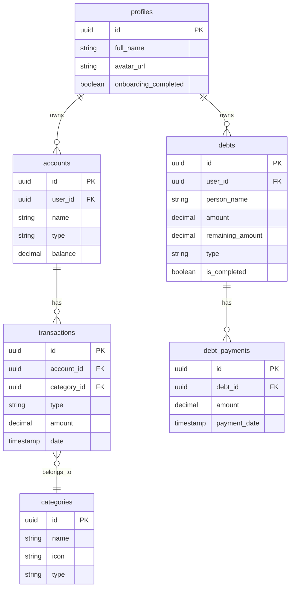

# 💰 Wallet Elite

<div align="center">


**Elite Finansal Yönetim Asistanı**

*Gelir, gider ve borçlarınızı tek bir yerden yönetin*

[Özellikler](#-özellikler) • [Kurulum](#-kurulum) • [Yapılandırma](#%EF%B8%8F-yapılandırma) • [Ekran Görüntüleri](#-ekran-görüntüleri) • [Teknolojiler](#-teknolojiler)

</div>

---

## ✨ Özellikler

### 💳 Cüzdan Yönetimi
- Birden fazla cüzdan/hesap oluşturma
- Nakit, banka kartı, kredi kartı desteği
- Anlık bakiye takibi

### 📊 İşlem Takibi
- Gelir ve gider kaydı
- Kategori bazlı sınıflandırma
- Tarih filtreleme
- Detaylı işlem geçmişi

### 💸 Borç Takibi
- Borç verme (lend) ve borç alma (borrow)
- Kısmi ödeme desteği
- Vade tarihi hatırlatması
- Ödeme geçmişi

### 📈 İstatistikler
- Kategori bazlı harcama analizi
- Gelir/gider trendi
- Tarih aralığına göre raporlama

### 🎨 Tema Desteği
- **10 farklı renk teması**: Elite, Midnight, Amethyst, Forest, Carbon, Ivory, Ocean, Velvet, Slate, Rose
- Açık/Koyu mod
- Sistem temasına uyum

### 🌍 Çoklu Dil
- 🇹🇷 Türkçe
- 🇬🇧 English
- 🇩🇪 Deutsch
- 🇫🇷 Français
- 🇪🇸 Español
- 🇮🇹 Italiano
- 🇵🇹 Português
- 🇳🇱 Nederlands
- 🇵🇱 Polski
- 🇷🇺 Русский
- 🇸🇦 العربية
- 🇮🇳 हिन्दी
- 🇨🇳 中文
- 🇯🇵 日本語
- 🇰🇷 한국어
- 🇹🇭 ไทย
- 🇻🇳 Tiếng Việt
- 🇮🇩 Indonesia

### 🔐 Güvenlik
- E-posta/Şifre ile kayıt
- Google Sign-In
- Supabase Row Level Security (RLS)

---

## 🚀 Kurulum

### Gereksinimler

- Flutter SDK 3.8.1+
- Dart SDK 3.8.1+
- Android Studio / VS Code
- Supabase hesabı

### Adımlar

1. **Repoyu klonla**
```bash
git clone https://github.com/kullanici/wallet_elite.git
cd wallet_elite
```

2. **Bağımlılıkları yükle**
```bash
flutter pub get
```

3. **Lokalizasyon dosyalarını oluştur**
```bash
flutter gen-l10n
```

4. **Uygulamayı çalıştır**
```bash
flutter run
```

---

## ⚙️ Yapılandırma

### Supabase Kurulumu

1. [Supabase](https://supabase.com) üzerinde yeni proje oluştur

2. **Veritabanı tablolarını oluştur:**

`supabase/migrations/` klasöründeki SQL dosyalarını sırasıyla çalıştır:
- `20260111_create_debts_table.sql`
- `20260112_create_debt_payments.sql`

Diğer tablolar için SQL Editor'da şu tabloları oluştur:
- `profiles`
- `accounts`
- `transactions`
- `categories`

3. **Authentication ayarları:**
   - Email/Password'ı etkinleştir
   - Google OAuth ekle (isteğe bağlı)

4. **API anahtarlarını al:**
   - Supabase Dashboard → Settings → API
   - `Project URL` ve `anon public` key'i kopyala

5. **Yapılandırma dosyasını düzenle:**

`lib/core/constants/supabase_config.dart`:
```dart
class SupabaseConfig {
  static const String url = 'YOUR_SUPABASE_URL';
  static const String anonKey = 'YOUR_ANON_KEY';
}
```

### Google Sign-In (isteğe bağlı)

1. [Google Cloud Console](https://console.cloud.google.com)'da OAuth 2.0 credentials oluştur
2. Android için SHA-1 fingerprint ekle
3. `android/app/google-services.json` dosyasını yerleştir

---

## 📱 Ekran Görüntüleri

> *Ekran görüntüleri yakında eklenecek*

| Dashboard | İşlemler | İstatistikler |
|:---------:|:--------:|:-------------:|
| 📊 | 📝 | 📈 |

---

## 🛠 Teknolojiler

| Kategori | Teknoloji |
|----------|-----------|
| **Framework** | Flutter 3.8+ |
| **Dil** | Dart 3.8+ |
| **Backend** | Supabase (PostgreSQL) |
| **State Management** | Riverpod |
| **Routing** | go_router |
| **Lokalizasyon** | flutter_localizations + intl |
| **Auth** | Supabase Auth + Google Sign-In |
| **Grafikler** | fl_chart |
| **Font** | Google Fonts (Inter) |
| **İkonlar** | Material Icons + Font Awesome |

---

## 📁 Proje Yapısı

```
lib/
├── core/                    # Ortak bileşenler
│   ├── constants/           # Sabitler (Supabase config)
│   ├── theme/               # Tema ve renk tanımları
│   ├── utils/               # Yardımcı fonksiyonlar
│   └── widgets/             # Ortak widget'lar
│
├── features/                # Feature-first mimari
│   ├── auth/                # Kimlik doğrulama
│   │   ├── data/            # Repository ve provider
│   │   ├── models/          # Veri modelleri
│   │   └── presentation/    # UI
│   │
│   ├── wallet/              # Cüzdan yönetimi
│   ├── transactions/        # İşlem takibi
│   ├── debts/               # Borç takibi
│   ├── statistics/          # İstatistikler
│   ├── settings/            # Ayarlar
│   └── home/                # Ana ekran
│
├── l10n/                    # Lokalizasyon dosyaları
│   ├── app_*.arb            # ARB çeviri dosyaları
│   └── app_localizations*.dart
│
└── main.dart                # Uygulama giriş noktası
```

---

## 🗃 Veritabanı Şeması



---

## 🧪 Test

```bash
# Tüm testleri çalıştır
flutter test

# Coverage raporu
flutter test --coverage
```

---

## 📦 Build

### Android (APK)
```bash
flutter build apk --release
```

### Android (AAB - Play Store)
```bash
flutter build appbundle --release
```

### iOS
```bash
flutter build ios --release
```

---

## 🤝 Katkıda Bulunma

1. Fork yapın
2. Feature branch oluşturun (`git checkout -b feature/amazing-feature`)
3. Commit yapın (`git commit -m 'Add amazing feature'`)
4. Push yapın (`git push origin feature/amazing-feature`)
5. Pull Request açın

---

## 📄 Lisans

Bu proje MIT lisansı altında lisanslanmıştır. Daha fazla bilgi için [LICENSE](LICENSE) dosyasına bakın.

---

## 👨‍💻 Geliştirici

**Harun Mercan**

- GitHub: [@HarunMercan](https://github.com/HarunMercan1)

---

<div align="center">

⭐ Bu projeyi beğendiyseniz yıldız vermeyi unutmayın!

</div>
